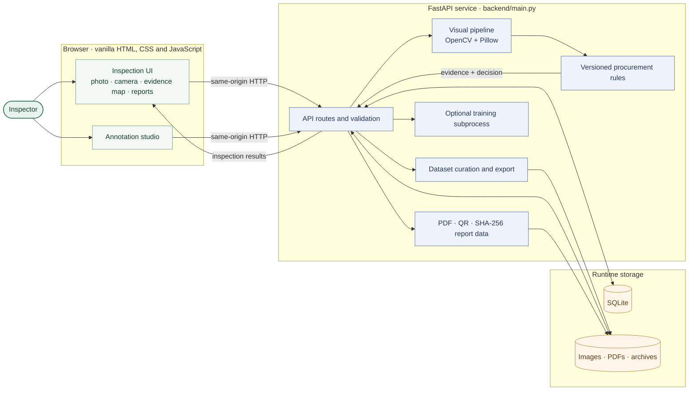

# PYAazScan

### Onion procurement inspection · Smart India Hackathon 26031

PYAazScan turns a smartphone photo into an explainable, onion-by-onion **external visual assessment**. Visual evidence, buyer-configurable grading rules, officer review and the final report are kept as distinct parts of the workflow.

> **Evidence first. Policy stays explicit. Human review stays in the loop.**
>
> **Demo status:** the active engine (`HSV-CONTOUR-DEMO-0.1`) uses classical OpenCV/Pillow image processing. It is **not a trained model** and has no claimed accuracy or field-performance metrics. The bundled onion image is synthetic—not field data.

[Quick start](#quick-start) · [Architecture](#architecture) · [Vercel deployment](#vercel-deployment) · [API](#api-at-a-glance) · [Project docs](#documentation)

## What it does

- **Inspect a sample:** upload a JPG/PNG/WEBP photo or capture a still frame; review image-quality warnings, onion outlines, visual cues and sample-level counts.
- **Keep evidence separate from policy:** an independently versioned rules profile maps measurements and visible cues to Grade A, URS, Reject or Manual Review. An officer can record an override.
- **Create a traceable record:** save the inspection, generate a PDF and QR link, and verify a SHA-256 hash of the canonical report data and source image.
- **Curate training data:** draw versioned, multi-label onion polygons, record annotator/lot/centre provenance, assign lot-safe splits and export a YOLO-seg dataset.

## Architecture



The browser calls the FastAPI service on the same origin. The image pipeline extracts measurements and visual cues; the rules engine applies the saved policy snapshot. SQLite and local files are suitable for this demo, not durable multi-instance hosting. See [`docs/ARCHITECTURE.md`](docs/ARCHITECTURE.md) for module boundaries and storage details.

## Quick start

**Requirements:** Python 3.11+ and a current browser. Camera capture needs browser permission and a secure origin (`localhost` or HTTPS).

```bash
python -m venv .venv
```

Activate the environment, then install and run:

```bash
# macOS / Linux
source .venv/bin/activate

# Windows PowerShell
# .venv\Scripts\Activate.ps1

python -m pip install -r requirements.txt
python -m uvicorn backend.main:app --reload --host 0.0.0.0 --port 8000
```

Open [http://localhost:8000](http://localhost:8000). API docs are at [http://localhost:8000/docs](http://localhost:8000/docs). The bundled synthetic fixture is ready to use; regenerating it is optional:

```bash
python data/demo/generate_demo.py
```

### Run with Docker

```bash
docker compose up --build
```

The container serves the app on port `8000` and mounts runtime data at `data/runtime`.

## 90-second demo

1. Open **New inspection** and enter a lot, centre and operator.
2. Choose **Load demo image** or upload a suitable photo. The demo image is synthetic.
3. Review the detected onion outlines, visual evidence and sample percentages. Select an onion to see its explanation.
4. Where available, resolve a Manual Review result with an officer decision.
5. Generate the PDF; open **Verify hash** to check the report-data and source-image evidence.

Camera mode processes a single captured still image. It does not continuously analyse video.

## Decision logic and limitations

The default `DEMO_45_65` profile treats 45–65 mm as an **editable engineering assumption** from the project brief. It is not presented as a current NAFED/NCCF/AGMARK specification, statutory certificate or universal buyer rule. Confirm the buyer's written requirements before use. Every inspection keeps the exact rule and engine versions used.

RGB images cannot reliably reveal internal rot, firmness, maturity, weight, moisture, smell, pesticide residue or hidden damage. Lighting, cultivar, overlap and camera processing affect the heuristic pipeline. Percentages describe only the photographed sample, not an independently representative lot estimate. Missing calibration or ambiguous evidence should be reviewed by a person.

## Dataset and optional training

- The bundled `frontend/assets/onion-demo.png` is a generated software fixture, excluded from uploaded-dataset counts and evaluation.
- Upload real images in **Dataset & labels**, then use **Annotate** to draw polygons and record labels, annotator, procurement centre, lot and split.
- Keep each procurement-centre/lot group in a single split. Export requires complete annotations and at least one train and one validation image; it does not invent splits.
- YOLO-seg export includes `data.yaml`, image/label folders, conversion notes and a native multi-label `annotations.json`. Since YOLO-seg rows are single-class, a polygon with multiple labels is represented by repeated rows in the YOLO labels.
- No field dataset, trained checkpoint or evaluation metrics are included. Training/evaluation scripts are optional and require a curated dataset; training also requires `ultralytics` (`pip install ultralytics`).

See [`docs/DATA_COLLECTION.md`](docs/DATA_COLLECTION.md), [`docs/MODEL_CARD.md`](docs/MODEL_CARD.md) and [`training/`](training/) before preparing or interpreting data.

## Vercel deployment

The repository is configured to expose `backend.main:app` through the Vercel FastAPI runtime (`[tool.vercel]` in `pyproject.toml`), which also declares every runtime dependency — Vercel prefers `pyproject.toml` over `requirements.txt` when both exist, and `uv.lock` pins the exact versions it installs. `vercel.json` keeps tests, docs and demo generators out of the serverless bundle. Import the repository with the **project root set to the repository root**, not `frontend/`. For Docker and local development, `requirements.txt` mirrors the runtime dependency set and adds the test tools. No separate frontend build command is needed because the app serves the `frontend/` static mount.

This is suitable for a lightweight demo, **not durable record keeping**. On Vercel, the app uses `/tmp/pyaazscan-runtime` because the project filesystem is read-only; `/tmp` is temporary and can differ between instances. Inspections, uploads and reports can be lost. Dataset ZIP uploads and the optional training subprocess are not suited to this serverless deployment. For persistent use, replace SQLite/files with managed database and object storage, and account for the platform's request-size and execution-time limits.

## API at a glance

| Workflow | Endpoints |
|---|---|
| Health and scan | `GET /api/health` · `POST /api/scan/image` · `POST /api/scan/camera` |
| Inspections and review | `GET /api/inspections` · `GET /api/inspection/{id}` · `POST /api/manual-review` · `GET /api/audit/{id}` |
| Rules and reports | `GET/POST /api/rules` · `POST /api/reports/generate` · `GET /api/reports/{id}/verify` · `GET /api/reports/{id}/pdf` |
| Dataset and training | `GET /api/dataset` · `POST /api/dataset/images` · `PUT /api/dataset/images/{id}/annotations` · `POST /api/dataset/export` · `POST /api/training/start` |

The full endpoint contract is in [`docs/API.md`](docs/API.md).

## Configuration, storage and security

- Local/container runtime files default to `data/runtime` (ignored by Git). Optional settings are documented in [`.env.example`](.env.example): `PYAaZSCAN_DATA_DIR`, `PYAaZSCAN_MAX_UPLOAD_BYTES` and `PYAaZSCAN_CORS_ORIGINS`.
- Image uploads are format-, size- and dimension-checked; filenames are sanitized. Dataset ZIP paths and extraction sizes are validated.
- This MVP does not provide user authentication/roles, encryption at rest, malware scanning or a production retention policy. Do not expose it as a public procurement service without adding appropriate controls.
- Report hashes detect changes to stored report data and source-image bytes. They are not a PDF signature, blockchain proof or independent trusted timestamp.

## Tests

```bash
python -m pytest
```

The suite covers the image pipeline, rules, API flows, persistence, reports and verification, annotation revisions, dataset export and training gates.

## Project layout

| Path | Responsibility |
|---|---|
| `frontend/` | Browser UI, styles and synthetic demo/calibration assets |
| `backend/main.py` | FastAPI routes, request validation and application wiring |
| `backend/services/` | Procurement rules, reports and dataset export |
| `backend/database.py` | SQLite schema and runtime storage paths |
| `ml/inference/` | Classical image-analysis pipeline |
| `training/` | Optional dataset validation, training, evaluation and export scripts |
| `tests/` | API, inference, rules, dataset and deployment tests |
| `docs/`, `research/` | API/architecture guidance, model scope and sourced references |

## Documentation

- [Architecture](docs/ARCHITECTURE.md) · [API](docs/API.md) · [Demo guide](docs/DEMO.md)
- [Model card](docs/MODEL_CARD.md) · [Data collection](docs/DATA_COLLECTION.md) · [Research sources](research/sources.json)
