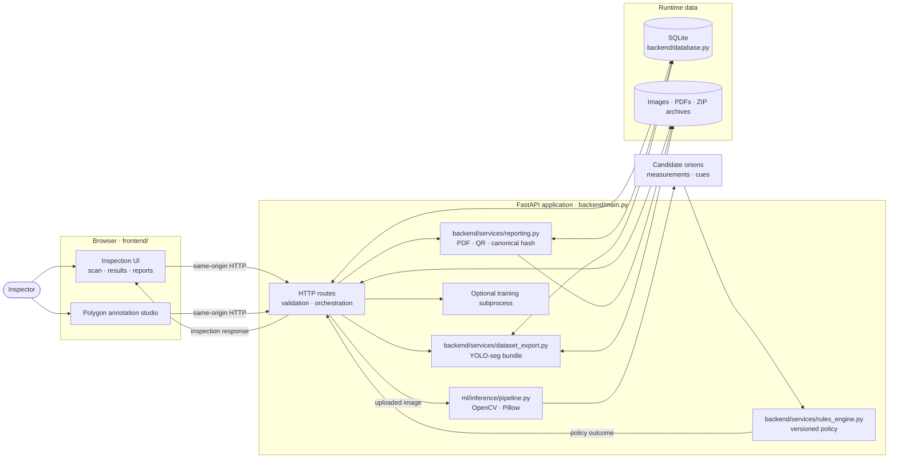

# Architecture

PYAazScan is a small **FastAPI modular monolith** with a static browser UI. The image pipeline extracts evidence; a separate policy module makes rule-profile decisions. This separation keeps visual heuristics from silently becoming procurement policy.

## System view

## Module responsibilities

| Module | Responsibility |
|---|---|
| `frontend/` | Vanilla HTML/CSS/JavaScript UI, camera still capture, inspection map, annotation studio and reports. Served at `/` by the FastAPI static mount. |
| `backend/main.py` | FastAPI application, API routes, request validation and workflow orchestration. Static files are mounted last so API and demo routes take precedence. |
| `ml/inference/pipeline.py` | Decode/normalize an image, issue quality cues, detect a possible 50 mm reference, and return heuristic onion candidates, polygons, measurements and visible-defect cues. It does not assign grades. |
| `backend/services/rules_engine.py` | Apply the selected, validated rule profile to inference evidence; return Grade A, URS, Reject or Manual Review. |
| `backend/database.py` | SQLite schema, short-lived connections, runtime path and transaction helpers. |
| `backend/services/reporting.py` | Canonicalize report data, calculate SHA-256 and generate the PDF/QR evidence files. |
| `backend/services/dataset_export.py` | Convert reviewed polygon annotations to a lot-safe YOLO-seg archive while retaining the native multi-label manifest. |
| `training/` | Optional dataset validation, training, evaluation and model export scripts; training is launched as a guarded subprocess. |

## Inspection request flow

1. The browser posts an uploaded photo or captured still frame to the same-origin scan endpoint.
2. The API validates the file, records its original bytes and runs the visual pipeline.
3. The rules engine evaluates the returned measurements and evidence against a copy of the active policy profile. When scale or evidence is insufficient, the engine can return Manual Review rather than invent a measurement.
4. The API persists the inspection, per-onion results, source-image metadata and audit event; the browser receives the inspection summary and overlays.
5. An officer can record a manual decision. Report generation snapshots the inspection and policy context, creates a PDF/QR, and records a canonical-data hash.

The active engine is `HSV-CONTOUR-DEMO-0.1`, a classical-CV fallback. Heuristic scores are not calibrated probabilities; there are no bundled trained weights or evaluation metrics. The 50 mm blue square provides a demo scale estimate only and is not certified metrology.

## Persistence and integrity

SQLite is the local MVP database. It stores inspections, onion decisions, defect evidence, measurements, active and historical policy versions, human overrides, reports, dataset images/annotations, exports, training jobs and audit events. Uploaded images, generated reports, staged archives and exports are written under `PYAaZSCAN_DATA_DIR`.

- Local default: `data/runtime/` (ignored by Git).
- Vercel default: `/tmp/pyaazscan-runtime/` because the deployed project directory is read-only. `/tmp` is temporary and per-instance; it is not durable or shared storage.

The report hash is over canonical JSON report data and includes the source-image SHA-256. Verification compares the saved report snapshot and current image bytes. It does not sign PDF bytes or provide a third-party timestamp, and QR verification is served by the same application.

## API groups

- Inspection: `POST /api/scan/image`, `POST /api/scan/camera`, `GET /api/inspections`, `GET /api/inspection/{id}`, `GET /api/dashboard`
- Policy and review: `GET/POST /api/rules`, `POST /api/manual-review`, `GET /api/audit/{inspection_id}`
- Reports: `POST /api/reports/generate`, `GET /api/reports`, `GET /api/reports/{id}`, `GET /api/reports/{id}/pdf`, `GET /api/reports/{id}/verify`, `GET /api/reports/{id}/qr`
- Dataset: `/api/dataset`, `/api/dataset/images`, annotation revision, archive staging and YOLO-seg export endpoints
- Models and training: `/api/models`, `/api/training/start`, `/api/training/{id}`

See [`API.md`](API.md) for request/response details and validation behavior.

## Deployment boundaries

Local development and Docker run one FastAPI process that serves both the UI and API. Vercel uses `backend.main:app` as its FastAPI entrypoint; the frontend is served through the static mount, while API calls remain same-origin. The Vercel setup is for demos: local SQLite and file writes use ephemeral `/tmp` storage, serverless instances are not a durable/shared database, and dataset ZIP uploads or long-running training are poor fits. A persistent hosted deployment needs managed database and object storage, plus authentication, retention controls and production-grade access/security review.
